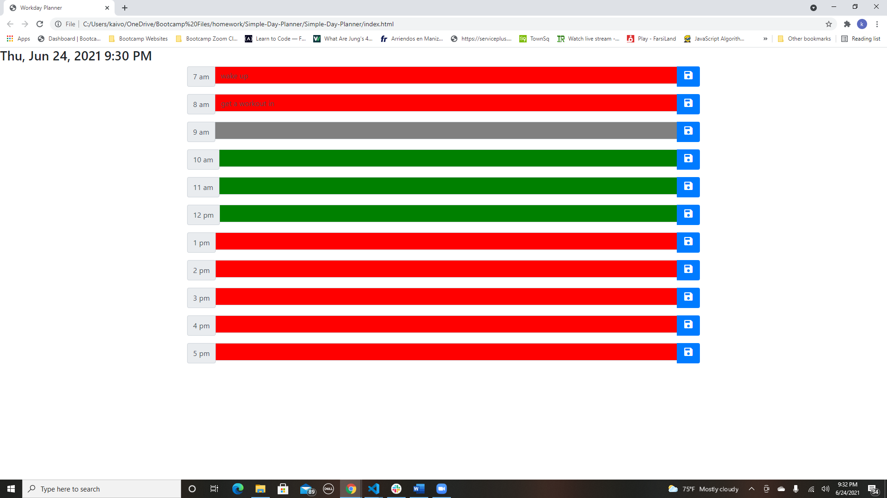

# Simple-Day-Planner

## Description and Usage

This is a simply day planner that can be edited and saved for the full workday. Just type in your activity or event at the corresponding time and click save and you are ready to go! 

## Link to my github account: 

https://github.com/kaivont85/Simple-Day-Planner

## Screenshot of Deployed Website

  
  
